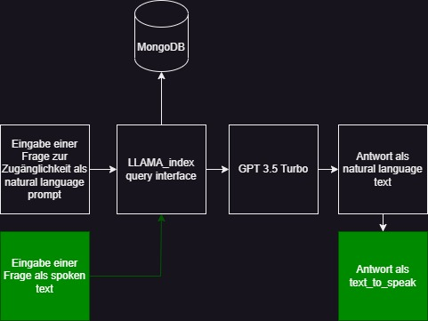

# Sitios Accessibility Information System
 
## Überblick
 
Das Sitios Accessibility Information System wurde entwickelt, um detaillierte Informationen über die Zugänglichkeit von Gebäuden zu liefern. Die Herausforderung besteht darin, die Vielfalt der Bedürfnisse verschiedener Menschen, insbesondere solcher mit besonderen Anforderungen, zu berücksichtigen. Dieses README erklärt den Lösungsansatz und wie die Anwendung verwendet werden kann.
 
## Aufgabenstellung
 
Die Aufgabenstellung besteht darin, genaue und detaillierte Informationen über die Zugänglichkeit von Gebäuden zu erfassen und für die Nutzer leicht zugänglich zu machen. Unterschiedliche Arten von Rollstühlen und individuelle Bedürfnisse machen es notwendig, dass die Informationen äußerst präzise und vielseitig sind. Das aktuelle Format der Informationen auf der Sitios-Website ist jedoch aufgrund der Menge an informationen teilweise unübersichtlich und schwer zu navigieren.
 
## Lösungsansatz
 
Um die Herausforderungen der aktuellen Informationsdarstellung zu bewältigen, wurde der folgende Lösungsansatz entwickelt:

### 1. Auto-fetch und Clean JSON to NOSQL
 
Die Lösung implementiert einen Webcrawler zum automatischen Herunterlaen der JSON-Dateien über die öffentlichen Gebäude. Diese Daten werden dann bereinigt, in einem klaren JSON-Format organisiert und in einer NOSQL-Datenbank gespeichert. Dieser Prozess gewährleistet, dass die Informationen aktuell und strukturiert sind.

 
### 2. LLAMA-Indexed Zugriff auf Echtzeit-Gebäudedaten
 
Um die Zugänglichkeit der Informationen zu verbessern, verwendet die Lösung ein LLAMA-Indexierungssystem. Dieses System ermöglicht einen schnellen und effizienten Zugriff auf relevante Daten. Die LLAMA-Indexierung ist wichtig, damit das Modell die Antwort anhand der Daten übers Gebäude beantwortet und nicht mittels generativer AI irgendwelche informationen erfindet. Zudem ermöglicht das LLAMA-Indexierungssystem mit der query-Funktion gezielt nach spezifischen Informationen zu suchen.
 
### 3. NLP-gesteuerte Abfragen für Genauigkeit
 
Die Lösung integriert ein GPT 3.5-Turmo Natural Language Processing (NLP)-Modell, um den Nutzern die Möglichkeit zu geben, präzise Abfragen zur Zugänglichkeit von Gebäuden durchzuführen. Dies trägt dazu bei, dass die Informationen genau und relevant sind. Nutzer können Fragen in natürlicher Sprache in unterschiedlichen Sprachen stellen, und das System wird die passenden Informationen liefern.
 
## Anwendung
 
Die Anwendung ist aktuell nur lokal verfügbar kann aber über dieses Github repo einfach auf einem Webserver integriert werden.

## Mitwirkende
 
- Christoph Landolt
- Noah Lüchinger
- Ruwen Frick
